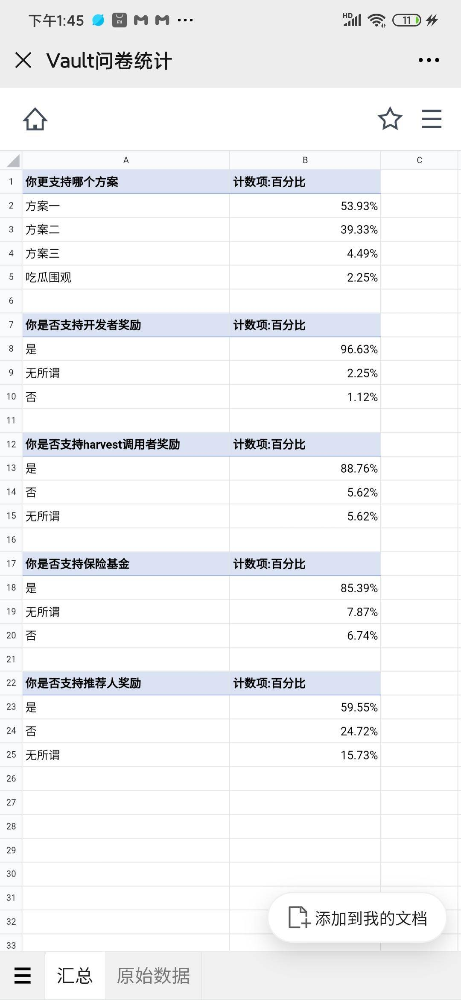
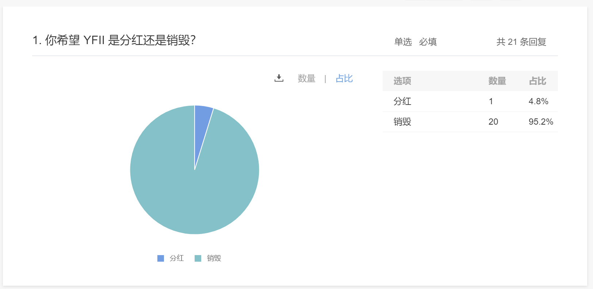

## Program content

2020.8.15 New proposals for the Vault pool are solicited in WeChat. There are 3 proposals. Currently, the first proposal is welcomed by most voting users. The proposal content is as follows:

  1.During the Vault harvest (grain harvest), the step of converting grain to DAI has a high slippage, and the trading pair with the highest currency transaction depth may change. At present, the technical team is separating out the transaction routing contract that converts grain into stable currency separately, and then it is up to governance to decide how to replace it, thereby reducing slippage.

  2.When the food is accumulated to a certain extent, it will be harvested by bots (robots). However, the transaction fee of Vault harvest is relatively high, about 0.1-0.2eth per transaction, and the daily cost of eight transaction pairs is about 10~20ETH, which is currently borne by the developer at his own expense. This situation is not sustainable. Therefore, the current development team discusses providing some incentives and handing them over to users to operate. The operator can get 1% of the profit of this transaction, increase the frequency of harvesting, and reduce the slippage of each transaction (the smaller the number of harvests, the lower the slippage). Due to the reduced slippage, it will actually increase the output of Vault, which is beneficial to the income of Vault users.

  3.Is the insurance fund added to insure the strategy for insurance businesses such as NXM?

  4.Referrer mechanism, whether wallet integration Vault / exchange integration Vault / personal invitation get a certain rebate, and what is the ratio?The advantage is to increase YFII Vault’s management funds (AUM), which is conducive to the long-term price of YFII. The disadvantage is to reduce a certain amount of Vault user profits.

  5.In addition to repurchase, how does Vault reflect the YFII price? Mortgage YFII into pool3 currently has no gains. Will it increase the mechanism of part of the profit distribution? Or will a certain percentage of profits be repurchased and directly destroyed by YFII?

## Community discussion opinions

Based on the discussion of core community members, the following plans were comprehensively put forward for everyone’s opinions:

10% of YFII Vault’s profit is used for the continuous development of the project, and the specific distribution is as follows:

  1. 5% as a developer fund and daily development needs (non-real-time distribution, governance resolution distribution method)

  2. 1% harvest subsidy (distributed to users who pay for gas in real time)

  3. 1% NXM insurance (non-real-time issuance, governance resolution issuance method)

  4. 3% Pool3 mortgages YFII’s dividend income

Option II:

The first three items are the same as Option 1, and the last item is changed to

3% profit repurchase YFII and burn it

third solution:

The first three items are the same as Option 1, without the final 3% destruction or dividend

## Community discussion opinions

After discussion in the community, the application for the first scheme currently has the highest number of votes, but the community has conflicts about dividends and destruction, so they discussed again and launched a vote again. The screenshot of the vote is as follows: 

## Finalize the proposal

  1. 5% of the profit of the Vault pool is used as developer funds and daily development needs (non-real-time distribution, governance resolution distribution method)

  2. 1% of the profit of the Vault pool is used as a harvest subsidy (distributed to users who pay for gas in real time)

  3. 1% of the profit of the Vault pool is used as NXM insurance (non-real-time distribution, governance decision distribution method)

  4.3% of Vault pool profits will be repurchased by YFII for destruction

- This scheme is only for the revenue of the Vault pool, and will not affect the revenue of Pool 1 and Pool 2.
- The governance voting time is 3 days, the voting rate must reach 20% of the entire network, and the support rate must reach 66%.

